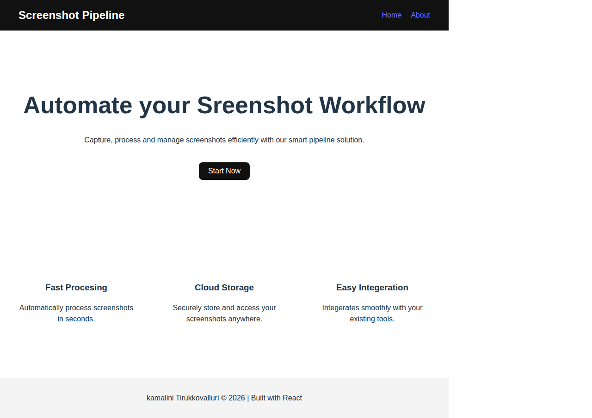

# 📸 Screenshot Pipeline Automation

This project demonstrates a fully automated CI/CD pipeline using:

- React (Vite)
- Playwright (Headless Browser Automation)
- GitHub Actions (CI/CD)
- Automatic Screenshot Generation
- Auto-commit from CI

---

## 🚀 How It Works

Every time code is pushed to `main`:

1. GitHub Actions builds the React app
2. Playwright launches a headless browser
3. A full-page screenshot is captured
4. `homepage.png` is updated automatically
5. The updated screenshot is committed back to the repository

No manual screenshots required.

---

## 📸 Live Screenshot (Auto Generated)

